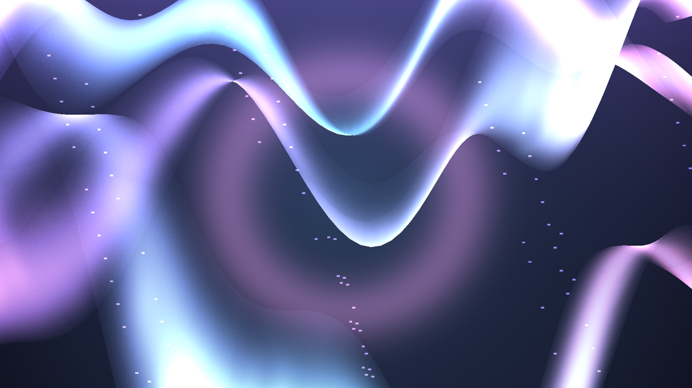
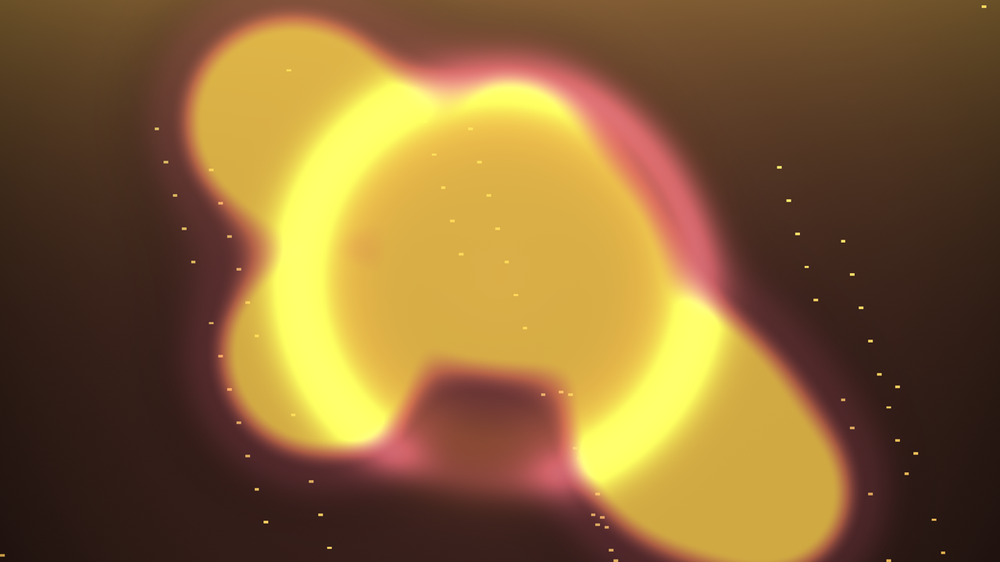
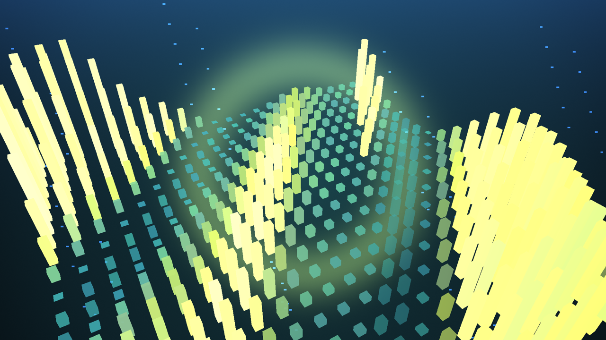
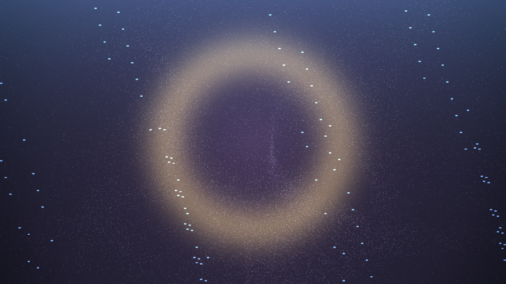
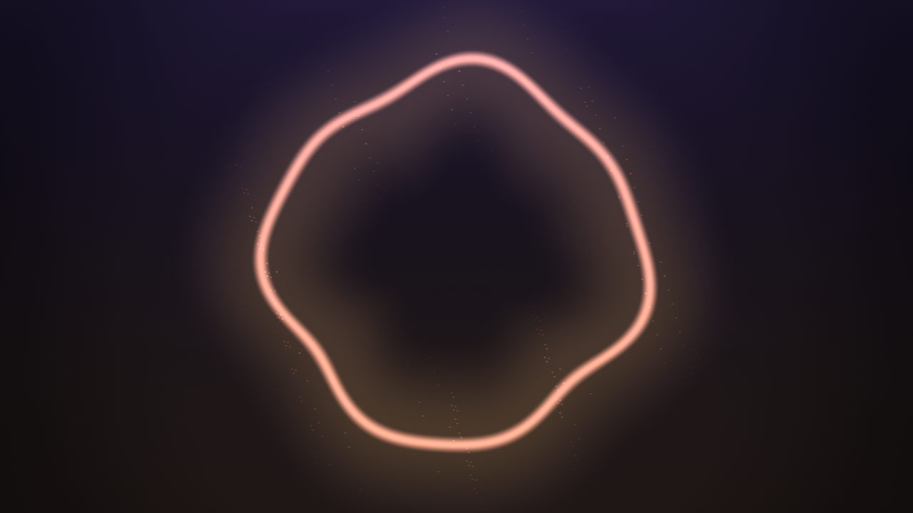
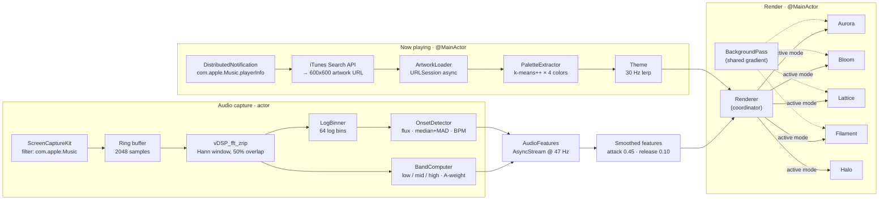

<div align="center">

# Auralis

**A modern macOS visualizer for Apple Music. Five sculptural,
generative modes — rendered in Metal, driven by ScreenCaptureKit,
re-tinted by the artwork of the track that's playing.**



[](https://www.apple.com/macos/)
[](https://www.swift.org)
[](https://developer.apple.com/metal/)
[](LICENSE)
[](#)

</div>

---

## About

Auralis is a tech-demo-grade visualizer for Apple Music on macOS. No
Winamp throwback bars, no preset cycler. Five distinct visual languages
— each implemented as a Metal pipeline, each reactive to a real FFT,
each retuned per track by a palette extracted from the current
artwork.

It's built around three deliberate ideas:

- **System audio without third-party drivers.** Auralis uses
  `ScreenCaptureKit` filtered to the Music app's bundle ID. No
  BlackHole, no Loopback, no virtual interface to install. The first
  launch asks for Screen Recording and that's it.
- **Generative, not reactive-by-numbers.** Every mode is a shader
  with its own visual register: ribbons and metaballs and rod fields
  and particle storms and editorial torii. They share audio features
  but draw their own conclusions.
- **The artwork drives the colour.** A k-means++ pass over each new
  track's artwork produces a four-colour palette. Every mode reads
  from the same `Theme` snapshot, so switching tracks (or modes)
  feels like the room changed lighting, not like a different app.

```
SCStream (Music.app, audio only)
  ↓
CMSampleBuffer  →  mono mix  →  2048-sample ring  →  Hann ⨉ vDSP_fft_zrip
                                                         ↓
                       LogBinner  ←  half-spectrum  →  BandComputer
                           ↓                              ↓
                         (64 bins)                  (low / mid / high)
                                                              ↓
                                                       OnsetDetector
                                                              ↓
                                                    AudioFeatures (≈ 47 Hz)
                                                              ↓
                                            Attack/Release smoothing ⇒ Renderer
```

A full pipeline + per-shader uniform mapping lives in
[DESIGN.md](DESIGN.md).

---

## Visualizer Modes

Switch modes with **⌘1 — ⌘5**, with the segmented control top-right,
or via the **Visualizer** menu (`Next Mode` is `⌥⌘→`).

### Aurora · ⌘1
> Northern lights, liquid glass.


Three layered ribbon meshes (96 × 28 quads each), vertex-displaced by
layered sinusoids whose amplitude tracks the **low band**. Camera
performs a slow orbital dolly with a breathing zoom. Fragment shader
sweeps `primary → secondary → accent` along ribbon length, adds fbm
filament streaks, and high-band sparkle along the crest.

### Bloom · ⌘2
> Metaball field, beat shockwaves.



Twelve small metaballs orbiting on independent Lissajous curves,
field merged with a softmin SDF whose merge radius tracks the **mid
band**. Each onset emits a soft radial shockwave through the field.
Pure fragment-shader pass — no geometry.

### Lattice · ⌘3
> Instanced 22 × 22 rod field, audio heightmap.



484 instanced rods drawn in a single indexed draw call. Each rod's
height samples a diagonal walk through the 64 log-spaced magnitudes;
loudness adds a universal floor and onsets pump every rod
simultaneously. Camera orbits and dips for cinematic parallax.

### Filament · ⌘4
> 80 000 point sprites, curl-noise flow.



80 000 particles drawn as point sprites with **no vertex buffer** —
positions are computed from `vertex_id` plus time inside the shader.
A finite-difference curl-noise field drives advection; **high-band**
energy scales the flow strength; onsets thrust the field outward.
Additive blending over the palette background gives a fog-of-light
falloff.

### Halo · ⌘5
> Editorial torus.



The minimalist mode. A superellipse-warped torus over a soft palette
wash. Ring thickness and radius track **loudness**; mid-band drives
the superellipse warp; high-band scatters fine sparkles inside the
ring. Designed for ambient background use — calm enough to leave on
a second monitor.

---

## Quick Start

Auralis needs **macOS 14 Sonoma+** and **Xcode 16**.

```bash
brew install xcodegen           # one-time
git clone https://github.com/katolikov/auralis.git
cd auralis
make run
```

That's it. The first launch shows an onboarding sheet:

1. Click **Open System Settings** under *Screen Recording* and toggle
   Auralis on. macOS requires this to feed audio into
   ScreenCaptureKit — no screen content is actually recorded, the
   capture is filtered to `com.apple.Music`.
2. Click **Open Music** under *Apple Music* and start a track.
3. Click **Start Visualizing**. From here on the onboarding sheet
   doesn't reappear.

If you have signing issues, set your `DEVELOPMENT_TEAM` in
`project.yml` and re-run `make`. The default `CODE_SIGN_IDENTITY` is
ad-hoc so it builds without a team.

---

## Keyboard Shortcuts

| Shortcut         | Action                       |
| ---------------- | ---------------------------- |
| `⌘1`             | Aurora                       |
| `⌘2`             | Bloom                        |
| `⌘3`             | Lattice                      |
| `⌘4`             | Filament                     |
| `⌘5`             | Halo                         |
| `⌥⌘→` / `⌥⌘←`    | Cycle next / previous mode   |
| `⌘D`             | Toggle the debug HUD         |
| `⌃⌘F`            | Enter / exit Full Screen     |

In Full Screen the cursor and chrome auto-hide after 2.5 s of
inactivity; any mouse move brings them back.

---

## Architecture



A deeper dive — feature-to-uniform mapping per shader, A-weighting
formula, smoothing constants, palette extraction recipe — lives in
[DESIGN.md](DESIGN.md).

---

## Tech Stack

| Layer            | Technology                                                |
| ---------------- | --------------------------------------------------------- |
| Language         | Swift 5.10, strict concurrency, `any`-existentials        |
| UI               | SwiftUI · AppKit bridges via `NSViewRepresentable`        |
| Rendering        | Metal 3 · MTKView · 120 fps on ProMotion                  |
| Audio capture    | ScreenCaptureKit, filtered to `com.apple.Music`           |
| Audio analysis   | `Accelerate.vDSP` — Hann + real FFT + log bins + bands    |
| Onsets           | Spectral flux + adaptive median+MAD threshold             |
| Now-playing      | `DistributedNotificationCenter` (Music.app)               |
| Artwork          | iTunes Search API (no auth) + URLSession                  |
| Palette          | CGImage downsample + k-means++ (12 Lloyd iterations)      |
| Project format   | XcodeGen (`project.yml`) — `.xcodeproj` regenerable       |
| Distribution     | Hardened runtime, app-sandboxed, MIT licensed             |

**Sandbox entitlements** — `app-sandbox`, `device.audio-input`,
`network.client`. Nothing else. No microphone, no file system, no
Apple Events.

**Telemetry** — none. The only network call is the iTunes Search API
to resolve artwork URLs.

---

## The Debug HUD

Toggle with **⌘D**. Shows everything the visualizer sees:

- Broadband RMS, A-weighted loudness, and the three band envelopes
  (low / mid / high) — all smoothed.
- BPM estimate and a beat dot that flashes on every onset.
- The 64-bin log spectrum as a live capsule bar graph.

Useful when you're tuning a new mode or debugging why a track isn't
making the visuals react.

---

## Project Layout

```
Auralis/
├── App/             SwiftUI @main · window plumbing · menu commands
├── Audio/           SCStream actor · vDSP FFT · onset detector
├── NowPlaying/      Music.app notification · iTunes search · k-means palette
├── Render/
│   ├── Visualizer.swift       protocol + VisualizerID + factory
│   ├── MatrixMath.swift       column-major helpers
│   ├── BackgroundPass.swift   shared gradient fullscreen pass
│   ├── OffscreenRenderer.swift  headless render (tests + tool)
│   ├── Renderer.swift         MainActor coordinator
│   ├── MetalView.swift        NSViewRepresentable bridge
│   ├── Modes/
│   │   ├── Aurora/
│   │   ├── Bloom/
│   │   ├── Lattice/
│   │   ├── Filament/
│   │   └── Halo/
│   └── Shaders/*.metal
├── UI/              SwiftUI views, Theme, debug HUD, onboarding
├── Tools/           --render-previews CLI mode
└── Resources/       Info.plist, entitlements

AuralisTests/        XCTest target — audio + per-mode snapshots
docs/previews/       Mode previews (regenerable via `make previews`)
```

---

## Building, Testing, Archiving

```bash
make build       # debug build
make run         # build and launch
make test        # xcodebuild test — all 10 tests should pass
make archive     # release archive at build/Auralis.xcarchive
make previews    # regenerate docs/previews/*.png from the running app
make clean       # nuke generated project + build dir
make open        # open Auralis.xcodeproj in Xcode
```

The first build downloads the Metal toolchain if it isn't installed
(`xcodebuild -downloadComponent MetalToolchain`, about 688 MB, one
time).

### Test target

```
$ make test
Test Suite 'AudioPipelineTests' passed (5 tests, 0.009s)
Test Suite 'VisualizerSnapshotTests' passed (5 tests, 0.229s)
```

`AudioPipelineTests` verifies FFT peak detection, log-bin counts,
band separation, onset firing, and palette extraction. `VisualizerSnapshotTests`
renders each mode to an offscreen 640 × 360 texture, attaches the
PNG to the Xcode test report, and gates on a minimum pixel-variance
threshold so an all-black frame fails.

### Regenerating preview imagery

`make previews` runs the app with `--render-previews docs/previews`.
The app boots into headless preview-render mode (no window), produces
1920 × 1080 PNGs for each of the five modes, and exits. Used to
refresh the gallery imagery in this README.

---

## Performance Notes

- 120 fps target on ProMotion displays, 60 fps elsewhere.
- The Metal pipeline is forward-only (no depth attachment for any
  mode except Lattice, which uses an always-pass depth state so MTKView's
  default depth attachment doesn't cull faces).
- FFT runs on the SCK delivery queue (serial). The actor only owns
  start/stop. No actor hops per audio frame.
- Smoothing runs on `@MainActor` once per audio frame — assignment
  cost only, no work.
- Filament's 80 000 point sprites are stateless: the shader computes
  position from `vertex_id` + time. No compute pass, no ping-pong
  buffers.

---

## Roadmap

All seven milestones from the original spec are shipped:

- [x] **M1** — Skeleton app · Metal pipeline · ScreenCaptureKit audio meter
- [x] **M2** — vDSP FFT · log bins · band energies · onset detector · debug HUD
- [x] **M3** — Music.app observer · iTunes artwork URL · k-means palette · overlay UI
- [x] **M4** — Aurora visualizer · `Visualizer` protocol · shared `BackgroundPass`
- [x] **M5** — Bloom · Lattice · Filament · Halo · mode switcher
- [x] **M6** — Fullscreen · menu-bar item · onboarding sheet
- [x] **M7** — Snapshot tests · DESIGN.md · 1.1 MB release archive

Potential next steps:

- A real 2D-FFT history buffer for Lattice (current implementation
  diagonals through the 1D spectrum).
- ACES tone-mapping pass on Filament for true HDR sparkle.
- An audio-driven 6th mode — perhaps a Bezier-warp wireframe sphere.
- AppleScript fallback for richer now-playing metadata (album art
  baked into the app's local artwork instead of the iTunes catalog).
- Notarized DMG release.

---

## Acknowledgements

Auralis is built on Apple frameworks doing the heavy lifting:

- [`ScreenCaptureKit`](https://developer.apple.com/documentation/screencapturekit)
  for the audio source.
- [`Accelerate.vDSP`](https://developer.apple.com/documentation/accelerate/vdsp)
  for the FFT and SIMD math.
- [`Metal`](https://developer.apple.com/metal/) and `MetalKit` for the
  render pipeline.
- [`SwiftUI`](https://developer.apple.com/xcode/swiftui/) and
  `Combine` for the app shell.

Project scaffolding by [XcodeGen](https://github.com/yonaskolb/XcodeGen).

---

## License

[MIT](LICENSE). See LICENSE for the full text.

If you ship something built on Auralis, no obligation but a
@katolikov ping on the result would make my day.
